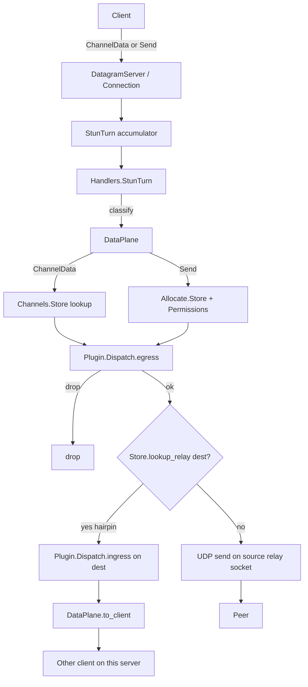
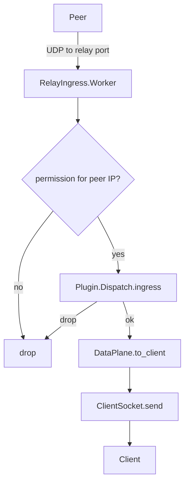

# XTurn architecture

This note is for people who know WebRTC from the JavaScript side
(`RTCPeerConnection`, `iceServers`, "TURN is the relay") and want a friendly map
of how XTurn is built -- without assuming you live in RFCs all day.

**One-line summary:** [xsockets](https://github.com/Lazarus404/xsockets) owns
sockets and "when is a full packet ready?". This package owns TURN/STUN logic,
allocations, and the relay path.

If you just want to run the server, start with [README.md](README.md).

## Mental model (JS -> XTurn)

| You already know | What XTurn does |
|---|---|
| `iceServers: [{ urls: "stun:..." }]` | STUN Binding -- "what is my public address?" |
| `iceServers: [{ urls: "turn:...", username, credential }]` | TURN Allocate -- "give me a relay address" |
| ICE gathering / connectivity checks | Binding + permissions + channels on the wire |
| Media / datachannel bytes after ICE connects | Hot path: ChannelData (or Send) through the relay |

Think of an **allocation** as a rented mailbox on the server: the client gets a
relay IP:port, peers send UDP there, and XTurn forwards to the right browser
socket.

## Layers (big picture)

```
Browser / native ICE client
        |
   UDP/TCP/TLS/DTLS   (often :3478 plain, :5349 secure)
        v
xsockets  (listen, accept, frame packets)
        |
Handlers.StunTurn     <- "is this media or a control request?"
   |-- DataPlane      <- ChannelData / Send  (fast path, stays on the listener)
   +-- ClientWorker   <- Allocate, Refresh, ChannelBind, ...
            |
     Allocate.Client  <- one process per allocation ("the mailbox")
            |
     relay UDP socket <- owned by RelayIngress shards
            |
          Peer
```

`RootSupervisor` runs the TURN tree and the Maru HTTP API as siblings. If the
HTTP API crashes, listeners keep running (and the other way around).

## Supervision (startup order)

`Xirsys.XTurn.Supervisor` starts roughly:

1. Cert watcher / SIGHUP hook (only if you have `:secure` listeners)
2. `Server`, `PacketLog.Writer`
3. `ClientWorker.Pool` -- workers for slow/control STUN requests
4. `RelayIngress` -- shards that own relay UDP sockets
5. Plugin supervisor
6. `Allocate.Supervisor` -- one child per live allocation
7. Auth supervisor -- users + nonces
8. xsockets supervisors (`SockSupervisor`, tier pools)
9. Listeners from `config :xturn, :listen`

On boot, `Xirsys.XTurn` also sets up ETS tables (fast in-memory maps): allocations,
channels, permissions, auth, byte counters, plugins, reservations, listen registry.

## Module map

### Listen and classify

| Module | Plain English |
|---|---|
| `ListenConfig` | Apply `XTURN_*` env overrides and extra bind IPs |
| `ListenRegistry` | Remember UDP endpoints for optional RFC 5780 tricks |
| `DatagramListener` | Wrap a UDP server and register its bound address |
| `SocketPipeline` | xsockets pipelines (stream vs datagram framing details) |
| `Accumulators.StunTurn` | Find STUN message / ChannelData boundaries |
| `Handlers.StunTurn` | Rate-limit *requests*; decide media vs control |

### Control plane (signaling-ish TURN messages)

| Module | Plain English |
|---|---|
| `Pipeline` | Decode STUN; run the right action list for the method |
| `Conn` | Request context + helpers (including nonce reuse on 401) |
| `Binding` | STUN Binding (ICE consent, XOR-MAPPED-ADDRESS) |
| `Actions.*` | Allocate, auth, Refresh, ChannelBind, CreatePerm, Send, ... |
| `ClientWorker` / `.Pool` | Run that pipeline *off* the hot listener process |
| `Auth.*` | Long-term users, TTL shared secret, optional ACCESS-TOKEN |

### Allocations and relay state

| Module | Plain English |
|---|---|
| `Allocate.Client` | One allocation: sockets, timers, lifetime |
| `Allocate.Store` | ETS indexes (client 5-tuple -> pid, relay -> dest, ...) |
| `Channels.Store` | Channel number -> peer + relay socket |
| `Permissions.Store` | Which peer IPs this allocation may talk to |
| `TimedEntry` | Map + cancelable timers (permissions, channels) |
| `Tuple5` | Client/server/protocol key (maps `0.0.0.0` to advertised IP) |
| `Allocate.Bytes`, `Quota`, `RelayPort`, `PeerFilter` | Counters, caps, ports, ACL |
| `ClientSocket` | Send back to the client without bothering `Allocate.Client` |

### Data plane (media bytes)

| Module | Plain English |
|---|---|
| `DataPlane` | Classify + forward ChannelData/Send; hairpin same-host calls |
| `RelayIngress` | Peer UDP -> permission check -> plugins -> client |
| `StunHelper` | Wrap Data / ICMP indications |
| `Plugin.Dispatch` | Optional per-allocation hooks ([PLUGIN.md](PLUGIN.md)) |

### HTTP API

`Xirsys.API` (Maru) plus auth/allocation routers: mint users, mint TURN REST
credentials, show allocation stats. Port comes from `config :maru, Xirsys.API`.

## Control vs media (why two paths?)

Same idea as separating your signaling WebSocket from your media path.

`Handlers.StunTurn` asks `DataPlane.classify/1`:

| Class | What it is | Where it runs |
|---|---|---|
| `{:channel, n, payload}` | ChannelData (typical browser media after ChannelBind) | `DataPlane` on the listener |
| `{:send, peer, payload}` | Send indication (before a channel exists) | `DataPlane` on the listener |
| `:control` | Allocate, Binding, Refresh, ... | `ClientWorker.Pool` -> `Pipeline` |
| ConnectionBind on spliced TCP | RFC 6062 TCP relay setup | `Pipeline` inline |

**Media never waits in the control worker pool.** That keeps ICE/auth work from
blocking the bytes once the call is up.

## Flow: client -> peer

After ICE has allocated (and usually bound a channel):



Step by step:

1. **Socket.** xsockets hands one framed packet to `Handlers.StunTurn`.
2. **Classify.** Looks like ChannelData? Send indication? Otherwise control.
3. **Lookup.** ChannelData uses the channel table; Send uses the allocation +
   permissions (when required).
4. **5-tuple key.** Listeners bound to `0.0.0.0` still match the *advertised*
   `server_ip` clients used in ICE.
5. **Plugins (egress).** Optional rewrite or `:drop`.
6. **Forward.**
   - **Hairpin:** both peers allocated on *this* XTurn -- deliver locally, no
     extra UDP hop.
   - **Otherwise:** write UDP on the allocation's relay socket toward the peer.
7. **Touch.** Roughly once a minute, live traffic refreshes permission / channel /
   allocation timers so Chrome's occasional missing Refresh does not kill a long
   call.

Before ChannelBind, browsers often use Send indications. After ChannelBind,
they prefer ChannelData (smaller headers, happier hot path).

## Flow: peer -> client

Relay sockets are **not** the same as the public STUN/TURN listen sockets.
`Allocate.Client` opens them with `UDP.open_relay/2`; `RelayIngress` owns them
(sharded by port).



`to_client/4` picks ChannelData when a channel is bound for that peer, otherwise
a STUN Data indication.

ICMP on a relay socket becomes a STUN error indication back on the client socket.

## Lifetimes (why "touch" matters)

TURN leases expire. If nothing renews them, the call dies even though ICE once
succeeded.

| Timer | Default | Kept alive by |
|---|---|---|
| Permission | 300s | CreatePermission, ChannelBind, traffic `touch` |
| Channel | 600s | ChannelBind, `touch` with a channel number |
| Allocation | 600s | Refresh, `touch` |

Timers are cancelable (`TimedEntry`). A late "expired" message is ignored if a
newer timer already replaced it.

## Related packages

| Package | Role |
|---|---|
| [xsockets](https://github.com/Lazarus404/xsockets) | Transports, framing engine, listeners |
| [xmedialib](https://github.com/Lazarus404/xmedialib) | STUN codec (`XMediaLib.Stun`) |
| [xturn-plugin-api](https://github.com/Lazarus404/xturn-plugin-api) | Plugin behaviour |
| [xturn-plugins](https://github.com/Lazarus404/xturn-plugins) | Example Guard / Metrics plugins |
